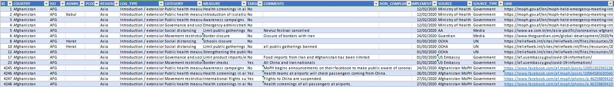

# ACAPS COVID19 Government Measures Dataset
[ACAPS](https://en.wikipedia.org/wiki/ACAPS) is a non-profit, non-governmental project that provides international, independent humanitarian analysis. During this pandemic, they put governments response to the Coronavirus outbreak. The measures implemented by governments are fall into give categories:

* Social distancing
* Movement restrictions
* Public health measures
* Social and economic measures
* Lockdowns

__Source__: 
https://www.acaps.org/covid19-government-measures-dataset


__Files & Folders__: 


* __~covid-19_goverment_measures_dataset~.xlsx__: the excel file includes a table of description, a tab of database and also a tab of dictionary



[__Terms__](https://creativecommons.org/licenses/by-nc-nd/4.0/legalcode): 
```
Attribution-NonCommercial-NoDerivatives 4.0 International (CC BY-NC-ND 4.0) 
```

__Archiving__:
Archive when new update

__Source of source__:

* Government
* Media
* Other organization
* UN
* Others
