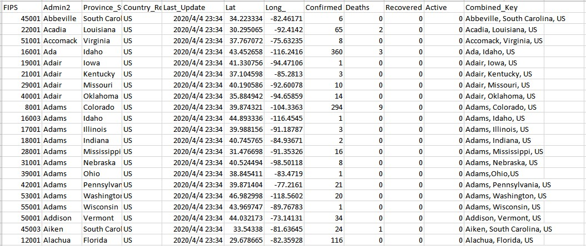
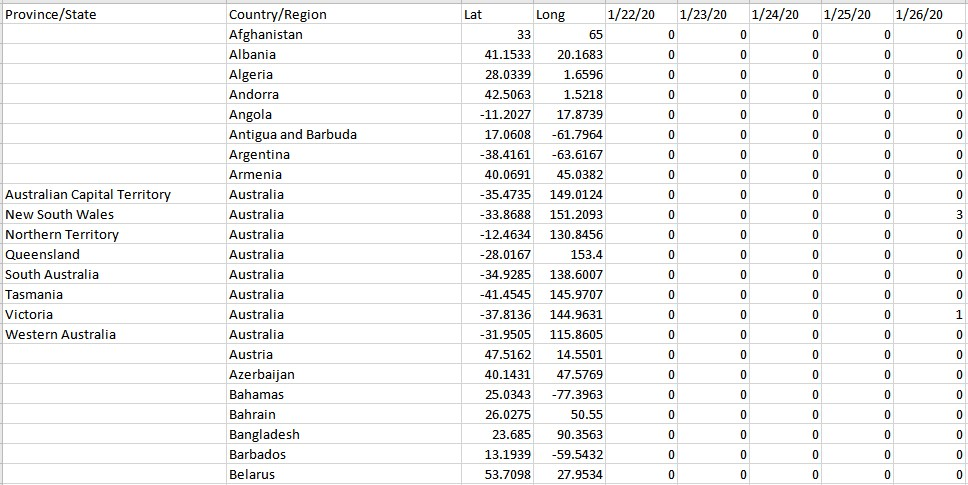
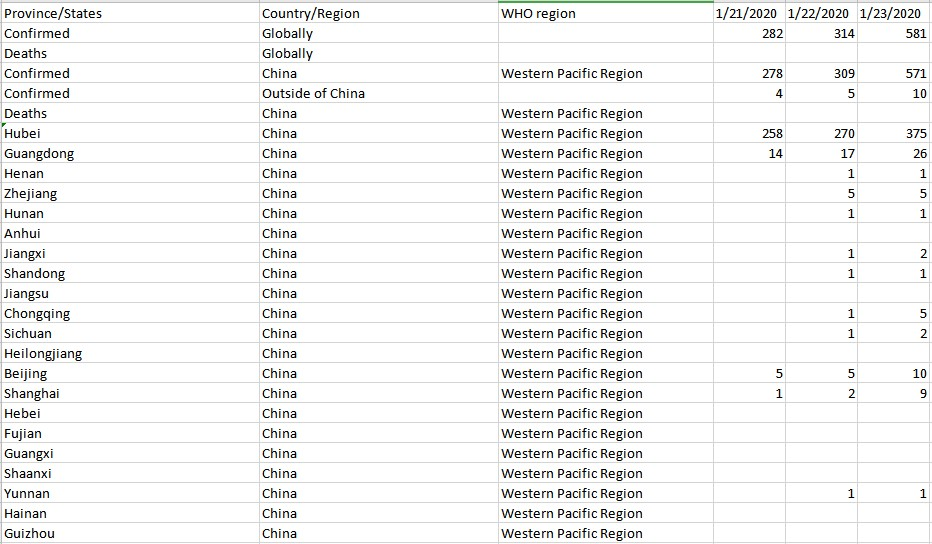

# Cases Stat from JHU CSSE
> This is the data repository for the 2019 Novel Coronavirus Visual Dashboard operated by the Johns Hopkins University Center for Systems Science and Engineering (JHU CSSE). Also, Supported by ESRI Living Atlas Team and the Johns Hopkins University Applied Physics Lab (JHU APL).

The datasets includes a worldwide daily report and time series. The dataset also include the WHO's daily situation report and time series, but considering the file format and update frequency, only the time series from WHO will be collected here.

__Source__: https://github.com/CSSEGISandData/COVID-19

__Files & Folders__: 

* csse_covid_19_daily_reports: daily new confirmed/deaths cases statistics per country/state

* csse_covid_19_time_series: time series of confirmed/death/recovered number, include global and US data

* who_covid_19_sit_rep_time_series: time series from who situation report

[__Terms__](https://github.com/CSSEGISandData/COVID-19): 
> [This GitHub repo](https://github.com/CSSEGISandData/COVID-19) and its contents herein, including all data, mapping, and analysis, copyright 2020 Johns Hopkins University, all rights reserved, is provided to the public strictly for educational and academic research purposes. The Website relies upon publicly available data from multiple sources, that do not always agree. The Johns Hopkins University hereby disclaims any and all representations and warranties with respect to the Website, including accuracy, fitness for use, and merchantability. Reliance on the Website for medical guidance or use of the Website in commerce is strictly prohibited.

__Archiving__:
* csse_covid_19_daily_reports: no archive
* csse_covid_19_time_series: archive when update
* who_covid_19_sit_rep_time_series: archive when update