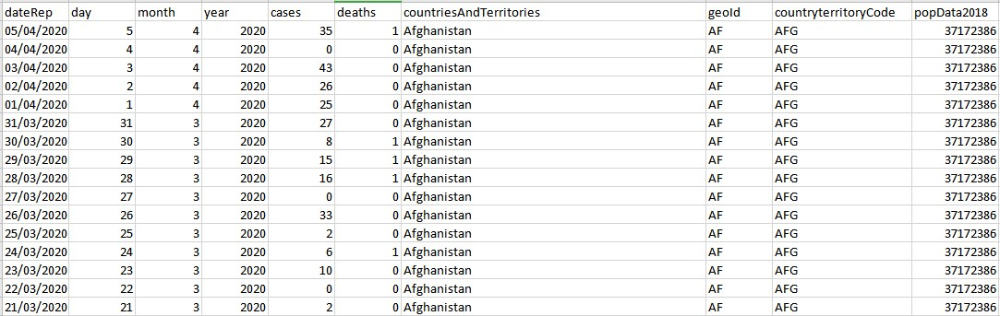

# Geographic distribution of COVID-19 cases worldwide from ecdc
This dataset is collected by ECDC(European Centre for Disease Prevention and Control).
> The downloadable data file is updated daily and contains the latest available public data on COVID-19. You may use the data in line with ECDC’s copyright policy.

__Source__: https://www.ecdc.europa.eu/en/publications-data/download-todays-data-geographic-distribution-covid-19-cases-worldwide

__Files & Folders__: 

* geographic_distribution_of_COVID-19_cases_worldwide.csv: a time series report contains daily confirmed and death report worldwide. The population number of each country is also listed.


[__Terms__](https://www.ecdc.europa.eu/en/copyright): 
```
The contents of these Web Pages are © ECDC [2005-2019].

In particular, unless otherwise stated, ECDC, according to current EU and International legislation, is the owner of copyright and database rights in this website and its contents.

Information and documents made available on ECDC web pages and for which ECDC owns the copyright are public and may be reproduced, adapted and/or distributed, totally or in part, irrespective of the means and/or the formats used, provided that ECDC is always acknowledged as the original source of the material. Such acknowledgement must be included in each copy of the material. 

Citations may be made from such material without prior permission, provided the source is always acknowledged.

The above mentioned permissions DO NOT apply to content supplied by third parties. Therefore, for documents where the copyright lies with a third party, permission for reproduction must be obtained from the copyright holder.
```

__Archiving__:
Archive when new update

__Source of source__:
https://www.ecdc.europa.eu/en/novel-coronavirus-china/sources-updated