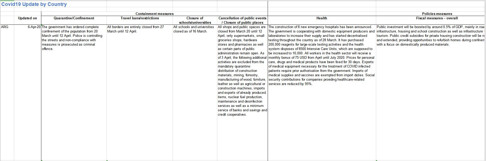

# OECD Country Policy Tracker
OECD provding this global response to covid-19 on their website.

__Source__: 
* [Direct Link](https://oecd.github.io/OECD-covid-action-map/)
* [Descriptive Page](http://www.oecd.org/coronavirus/en/)

__Files & Folders__: 

* CoronavirusUpdate_AllCountries_Public.xlsx: A matrix displaying the Containment measures or Policies measures in countries. The content is descriptive.



[__Terms__](http://www.oecd.org/termsandconditions/): 
```
The OECD makes data (the “Data”) available for use and consultation by the public.  Data may be subject to restrictions beyond the scope of these Terms and Conditions, either because specific terms apply to those Data or because third parties may have ownership interests. It is the User’s responsibility to verify, either directly in the metadata or, if available, by clicking on the  icon and then referring to the "source" tab, whether the Data is fully or partially owned by third parties and/or whether additional restrictions may apply, and to contact the owner of the Data before incorporating it in your work in order to secure the necessary permissions. The OECD in no way represents or warrants that it owns or controls all rights in all Data, and the OECD will not be liable to any User for any claims brought against the User by third parties in connection with the use of any Data.

Permitted use

Except where additional restrictions apply as stated above, You can extract from, download, copy, adapt, print, distribute, share and embed Data for any purpose, even for commercial use. You must give appropriate credit to the OECD by using the citation associated with the relevant Data, or, if no specific citation is available, You must cite the source information using the following format: OECD (year), (dataset name),(data source) DOI or URL (accessed on (date)). When sharing or licensing work created using the Data, You agree to include the same acknowledgment requirement in any sub-licenses that You grant, along with the requirement that any further sub-licensees do the same.

© 2019 Organisation for Economic Co-operation and Development 
```

__Archiving__:
Archive when new update

__Source of source__:
Unknown