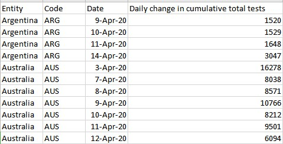
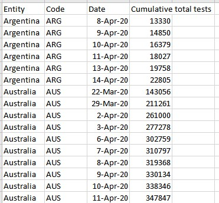

# Ourworldindata tests statistic for COVID-19
The COVID-19 testing data is an important factor to know the progress of the pandemic. The testing number ourworldindata.org present is test for the presence of the virus. And there are some factors needs to be clarifed for the testing, like the number refers to "performed tests" or "individual tests", please read their page for more detail and the source information by country.

__Source__: 
https://ourworldindata.org/covid-testing

__Files & Folders__: 

* full-list-covid-19-tests-per-day.csv: Daily testing number per country

* full-list-covid-19-tests-per-day.json: A json format of full-list-covid-19-tests-per-day, not friendly for human reading
* full-list-total-tests-for-covid-19.csv: A daily cumulative total tests number per country

* full-list-total-tests-for-covid-19.json: A json format of full-list-total-tests-for-covid-19, not friendly for human reading

__Terms:__
[CC BY 4.0](https://creativecommons.org/licenses/by/4.0/)

__Archiving__:
Refer to this [page](https://ourworldindata.org/covid-testing).

__Source of source__:
There is a source for each country, mostly are from the public health agency, ourworldindata listing in their page.