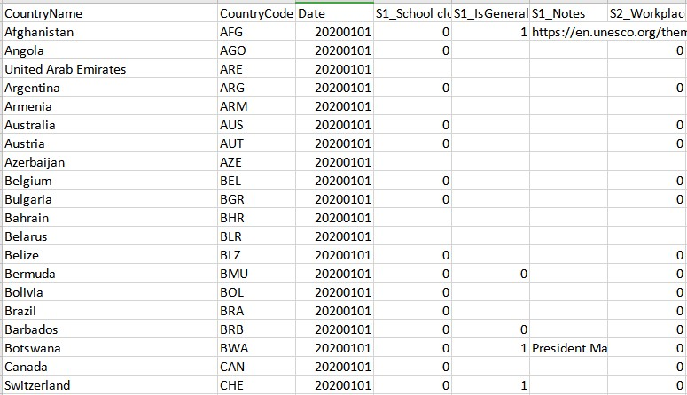

# Oxford covid 19 government response tracker
This dataset is maintenaced by the team of Oxford COVID-19 Government Response Tracker. The dataset describe how the global governments response to the pandemic.

__Source__: https://www.bsg.ox.ac.uk/research/research-projects/oxford-covid-19-government-response-tracker

__Files & Folders__: 

* OxCGRT_Download_latest_data.xlsx: A time series of government's response all over the world. News links are provided.


> OxCGRT collects publicly available information on 11 indicators of government response (S1-S11). The first seven indicators (S1-S7) take policies such as school closures, travel bans, etc. are recorded on an ordinal scale; the remainder (S8-S11) are financial indicators such as fiscal or monetary measures. For a full description of the data and how it is collected, see this working paper.

[__Terms__](https://creativecommons.org/licenses/by/4.0/): 
```
Creative Commons Attribution CC BY standard.
```

__Archiving__:
Archive when new update

__Source of source__:
> Data is collected from public sources by a team of dozens of Oxford University students and staff from every part of the world.
