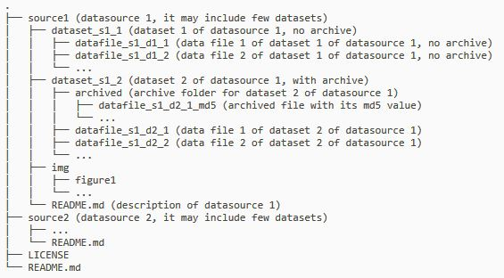

# covid-19-data-aggregation
The aggregation of various datasets related to covid-19, being updated by scripts automatically.

## Type of source
All dataset comes from two types of sources, one is the other github repository like [JHU CSSE](https://github.com/CSSEGISandData/COVID-19) stat data, the other type is downloadable content from websites like [ecdc](https://www.ecdc.europa.eu/en/publications-data/download-todays-data-geographic-distribution-covid-19-cases-worldwide). 

## Mode of archive
For some dataset which are providing historical data like [csse_covid_19_daily_reports](https://github.com/kinyue/covid-19-data-aggregation/tree/master/Cases%20Stat%20from%20JHU%20CSSE/csse_covid_19_daily_reports), no archiving activate. For the other dataset, archive will saved in a sub-folder like [csse_covid_19_time_series](https://github.com/kinyue/covid-19-data-aggregation/tree/master/Cases%20Stat%20from%20JHU%20CSSE/csse_covid_19_time_series) and file will be named with its md5 value.

## Folder structure

## List of datasets
|Source|Data Set|Source Type|Have Archive? |Data Type|
|---|---|---|---|---|
|[Cases Stat from JHU CSSE](https://github.com/CSSEGISandData/COVID-19)|[csse_covid_19_daily_reports](https://github.com/kinyue/covid-19-data-aggregation/tree/master/Cases%20Stat%20from%20JHU%20CSSE/csse_covid_19_daily_reports)|Github Repository|No|Daily report|
|[Cases Stat from JHU CSSE](https://github.com/CSSEGISandData/COVID-19)|[csse_covid_19_time_series](https://github.com/kinyue/covid-19-data-aggregation/tree/master/Cases%20Stat%20from%20JHU%20CSSE/csse_covid_19_time_series)|Github Repository|Yes|Time series|
|[Cases Stat from JHU CSSE](https://github.com/CSSEGISandData/COVID-19)|[who_covid_19_sit_rep_time_series](https://github.com/kinyue/covid-19-data-aggregation/tree/master/Cases%20Stat%20from%20JHU%20CSSE/who_covid_19_sit_rep_time_series)|Github Repository|Yes|Time series|
|[ECDC](https://www.ecdc.europa.eu/en/publications-data/download-todays-data-geographic-distribution-covid-19-cases-worldwide)|[Geographic distribution of COVID-19 cases worldwide from ecdc](https://github.com/kinyue/covid-19-data-aggregation/tree/master/Geographic%20distribution%20of%20COVID-19%20cases%20worldwide%20from%20ecdc)|Web Page|Yes|Daily report|
|[Oxford](https://www.bsg.ox.ac.uk/sites/default/files/OxCGRT_Download_latest_data.xlsx)|[Oxford covid 19 government response tracker](https://github.com/kinyue/covid-19-data-aggregation/tree/master/Oxford%20covid%2019%20government%20response%20tracker)|Web Page|Yes|Policy|
|[Nextstrain](https://github.com/nextstrain/ncov)|[SARS-CoV-2 genomes from Nextstrain](https://github.com/kinyue/covid-19-data-aggregation/tree/master/SARS-CoV-2%20genomes%20from%20Nextstrain)|Github Repository|Yes|Gene Data|
|Others|[Static data or metadata](https://github.com/kinyue/covid-19-data-aggregation/tree/master/Static)|Various|Yes|Metadata|

## Other data collection
There are also serveral pages collecting and maintenace the dataset related to covid-19. Check out the list below.
[Our World in Data](https://ourworldindata.org/coronavirus): This page of ourworld in data collect various datasets about covid-19. They also have data visualization for the data they collected. 
[Worldometers](https://www.worldometers.info/coronavirus/): Worldometers provide constantly update of statistic of covid-19 situation. You can also find a lot of static data or metadata from this site.
[Humdata](https://data.humdata.org/event/covid-19): Users uploaded datasets. This page contains most of the covid-19 related data including its source and data collection methodlogy. 
[The COVID Tracking Project](https://covidtracking.com/api): Provide api to obtain dataset, most of them are US statistic data.
[UN Database](https://www.un.org/en/databases/): Databases from United Nations. Inlcude the world population [statistics](https://population.un.org/wpp/Download/Standard/Population/).
[OpenMD](https://openmd.com/directory/covid-19#covid-19-data-and-visualizations): A reousrce directory for COVID-19 related, including links to datasets/journal and agencies.
> OpenMD.com is a search engine that makes high-quality medical information easily accessible to everyone.

