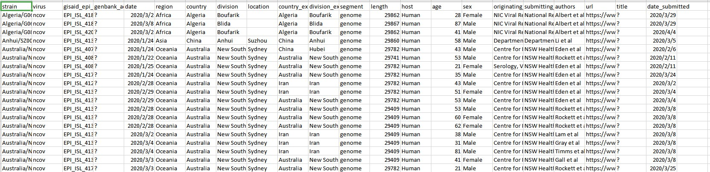

# SARS-CoV-2 genomes metadata from Nextstrain
Genome meta data pick up by Nextstrain. Find the data visulization from their [website](https://nextstrain.org/ncov).

__Source__: https://github.com/nextstrain/ncov

__Files & Folders__: 

* metadata.tsv: metadata information of SARS-CoV-2 genome submitted in GISAID. However, there is no pathogen evolution data in this repo.



[__Terms__](https://github.com/nextstrain/ncov/blob/master/LICENSE): 
```
MIT License
```

__Archiving__:
Archive when new update

__Source of source__:
Data are collected automatically from GISAID.